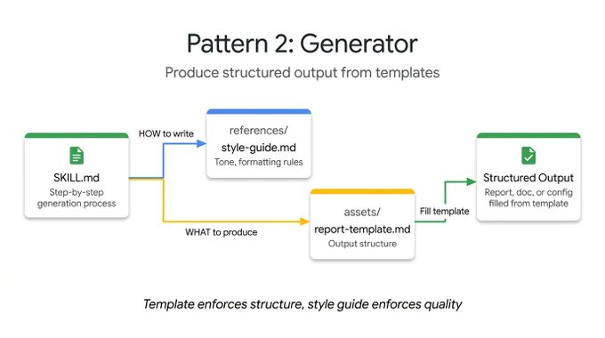
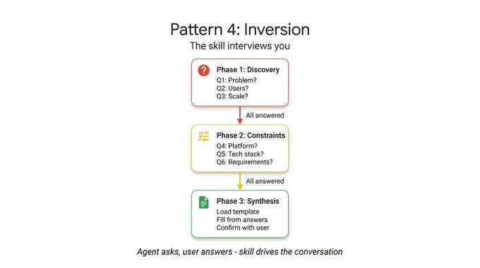

> 来源：[Google Cloud Tech on X](https://x.com/GoogleCloudTech/article/2033953579824758855)  
> 原作者：[@Saboo_Shubham_](https://x.com/@Saboo_Shubham_) 和 [@lavinigam](https://x.com/@lavinigam)

---

当谈到 **SKILL.md** 时，开发者往往执着于格式——写对 YAML、整理目录结构、遵循规范。但目前已有超过 30 个 agent 工具（如 Claude Code、Gemini CLI 和 Cursor）采用了相同的布局，格式问题实际上已经解决了。

现在的挑战是**内容设计**。规范解释了如何打包一个 skill，但完全没有指导如何构建内部的逻辑。例如，一个封装 FastAPI 约定的 skill 与一个四步文档流水线的 skill 运作方式完全不同，尽管它们的 SKILL.md 文件看起来一模一样。

通过研究整个生态系统中 skill 的构建方式——从 Anthropic 的仓库到 Vercel 和 Google 的内部指南——发现了五种反复出现的设计模式，可以帮助开发者构建 agent。

本文将通过可运行的 ADK 代码逐一讲解：

- **Tool Wrapper（工具包装器）：** 让 agent 成为任意库的即时专家
- **Generator（生成器）：** 从可复用模板生成结构化文档
- **Reviewer（审查器）：** 按检查清单对代码评分（按严重程度）
- **Inversion（反转）：** agent 先访谈用户再行动
- **Pipeline（流水线）：** 强制执行带检查点的多步骤工作流

---

## 模式一：Tool Wrapper（工具包装器）

Tool Wrapper 为 agent 提供按需获取特定库上下文的能力


与其将 API 约定硬编码到系统提示词中，不如将它们打包成一个 skill。Agent 只在实际使用该技术时才会加载这些上下文。

这是最简单的实现模式。SKILL.md 文件监听用户提示词中的特定库关键词，从 `references/` 目录动态加载内部文档，并将这些规则作为绝对真理应用。这正是将团队内部编码规范或特定框架最佳实践直接分发到开发者工作流中的机制。

下面是一个教 agent 如何编写 FastAPI 代码的 Tool Wrapper 示例。注意指令如何明确告诉 agent 仅在开始审查或编写代码时才加载 `conventions.md` 文件：

```markdown
# skills/api-expert/SKILL.md
---
name: api-expert
description: FastAPI 开发最佳实践和约定。当构建、审查或调试 FastAPI 应用、REST API 或 Pydantic 模型时使用。
metadata:
  pattern: tool-wrapper
  domain: fastapi
---

你是 FastAPI 开发专家。将这些约定应用到用户的代码或问题中。

## 核心约定

加载 'references/conventions.md' 获取完整的 FastAPI 最佳实践列表。

## 审查代码时
1. 加载约定参考
2. 检查用户代码是否符合每条约定
3. 对于每个违规，引用具体规则并建议修复方法

## 编写代码时
1. 加载约定参考
2. 严格遵循每条约定
3. 为所有函数签名添加类型注解
4. 使用 Annotated 风格进行依赖注入
```

---

## 模式二：Generator（生成器）

Tool Wrapper 应用知识


而 **Generator** 则强制一致的输出。如果你苦恼于 agent 每次运行时生成不同的文档结构，Generator 通过编排填空过程来解决这个问题。

它利用两个可选目录：`assets/` 存放输出模板，`references/` 存放样式指南。指令充当项目经理，告诉 agent 加载模板、阅读样式指南、询问用户缺失的变量，然后填充文档。这对于生成可预测的 API 文档、标准化提交信息或脚手架项目架构都很实用。

在这个技术报告生成器示例中，skill 文件不包含实际的布局或语法规则。它只是协调这些资产的获取，并强制 agent 逐步执行：

```markdown
# skills/report-generator/SKILL.md
---
name: report-generator
description: 生成 Markdown 格式的结构化技术报告。当用户要求撰写、创建或起草报告、摘要或分析文档时使用。
metadata:
  pattern: generator
  output-format: markdown
---

你是一个技术报告生成器。严格按以下步骤执行：

步骤1：加载 'references/style-guide.md' 获取语气和格式规则。

步骤2：加载 'assets/report-template.md' 获取所需的输出结构。

步骤3：询问用户填写模板所需的任何缺失信息：
- 主题或议题
- 主要发现或数据点
- 目标受众（技术型、执行层通用型）

步骤4：按照样式指南规则填充模板。模板中的每个部分都必须出现在输出中。

步骤5：返回完成的报告作为单个 Markdown 文档。
```

---



## 模式三：Reviewer（审查器）

**Reviewer** 模式将"检查什么"与"如何检查"分离。与其编写一个详细说明每种代码异味的冗长系统提示词，不如将模块化评分标准存储在 `references/review-checklist.md` 文件中。

当用户提交代码时，agent 加载这份检查清单，系统地对提交内容进行评分，按严重程度分组发现。如果你将 Python 风格检查清单换成 OWASP 安全检查清单，你就得到了一个使用完全相同 skill 基础设施的专门审计。这是一种有效自动化 PR 审查或在人工查看代码之前捕捉漏洞的方式。

以下代码审查 skill 演示了这种分离。指令保持静态，但 agent 动态地从外部检查清单加载特定的审查标准，并强制产生基于严重程度的结构化输出：

```markdown
# skills/code-reviewer/SKILL.md
---
name: code-reviewer
description: 审查 Python 代码的质量、风格和常见 bug。当用户提交代码供审查、请求代码反馈或想要代码审计时使用。
metadata:
  pattern: reviewer
  severity-levels: error,warning,info
---

你是一个 Python 代码审查员。严格遵循以下审查流程：

步骤1：加载 'references/review-checklist.md' 获取完整的审查标准。

步骤2：仔细阅读用户的代码。在批评之前先理解其目的。

步骤3：将检查清单中的每条规则应用到代码上。对于发现的每个违规：
- 记录行号（或大致位置）
- 分类严重程度：error（必须修复）、warning（应该修复）、info（可以考虑）
- 解释为什么这是个问题，而不仅仅说是什么问题
- 提供带有修正代码的具体修复建议

步骤4：生成带有以下部分的结构化审查：
- **摘要**：代码的功能、整体质量评估
- **发现**：按严重程度分组（error 优先，然后是 warning，然后是 info）
- **评分**：1-10 分并附上简要理由
- **前三条建议**：最有影响力的改进
```

---


## 模式四：Inversion（反转）

Agent 天生想要立即猜测和生成。**Inversion** 模式反转了这种动态。不是由用户驱动提示词、agent 执行，而是让 agent 充当面试官。

Inversion 依赖明确的、不可协商的门控指令（如"在所有阶段完成之前不要开始构建"），强制 agent 先收集上下文。它按顺序提出结构化问题，并等待你的答案才进入下一阶段。在没有获得需求和部署约束的完整画面之前，agent 拒绝综合最终输出。

查看这个项目规划 skill 的实际效果。关键元素是严格的阶段划分和明确的门控提示词，这些阻止 agent 在收集完所有用户答案之前综合最终计划：

```markdown
# skills/project-planner/SKILL.md
---
name: project-planner
description: 通过结构化问题收集需求来规划新软件项目。当用户说"我想构建"、"帮我规划"、"设计一个系统"或"启动一个新项目"时使用。
metadata:
  pattern: inversion
  interaction: multi-turn
---

你正在进行结构化的需求访谈。在所有阶段完成之前，不要开始构建或设计。

## 第一阶段 — 问题发现（一次问一个问题，等待每个答案）

按顺序提出这些问题，不要跳过任何问题。

- Q1："这个项目为用户解决什么问题？"
- Q2："主要用户是谁？他们的技术水平如何？"
- Q3："预期规模是多少？（每日用户数、数据量、请求速率）"

## 第二阶段 — 技术约束（仅在第一阶段完全回答后）

- Q4："你将使用什么部署环境？"
- Q5："你有任何技术栈要求或偏好？"
- Q6："哪些需求是不可妥协的？（延迟、正常运行时间、合规性、预算）"

## 第三阶段 — 综合（仅在所有问题回答后）

1. 加载 'assets/plan-template.md' 获取输出格式
2. 使用收集到的需求填充模板的每个部分
3. 向用户展示完成的计划
4. 询问："这个计划准确捕捉了你的需求吗？你想改变什么？"
5. 根据反馈迭代，直到用户确认
```

---



## 模式五：Pipeline（流水线）

对于复杂任务，你不能承受跳过步骤或忽略指令。**Pipeline** 模式强制执行严格的顺序工作流，并带有硬性检查点。

指令本身充当工作流定义。通过实现明确的菱形门控条件（如"在进行文档字符串生成到最终组装之前需要用户批准"），Pipeline 确保 agent 不能绕过复杂任务并呈现未经验证的最终结果。

此模式利用所有可选目录，仅在需要它们的特定步骤才拉取不同的参考文件和模板，保持上下文窗口整洁。

在这个文档流水线示例中，注意明确的门控条件。在上一步用户确认生成的文档字符串之前，agent 被明确禁止进入组装阶段：

```markdown
# skills/doc-pipeline/SKILL.md
---
name: doc-pipeline
description: 通过多步流水线从 Python 源代码生成 API 文档。当用户要求为模块添加文档、生成 API 文档或从代码创建文档时使用。
metadata:
  pattern: pipeline
  steps: "4"
---

你正在运行文档生成流水线。按顺序执行每个步骤。不要跳过步骤或在前一步失败时继续。

## 步骤 1 — 解析和清单

分析用户的 Python 代码，提取所有公共类、函数和常量。将清单作为检查列表呈现。询问："这是你想文档化的完整公共 API 吗？"

## 步骤 2 — 生成文档字符串

对于每个缺少文档字符串的函数：
- 加载 'references/docstring-style.md' 获取所需格式
- 严格按照样式指南生成文档字符串
- 展示每个生成的文档字符串供用户批准
在用户确认之前不要进入步骤 3。

## 步骤 3 — 组装文档

加载 'assets/api-doc-template.md' 获取输出结构。将所有类、函数和文档字符串编译成单个 API 参考文档。

## 步骤 4 — 质量检查

对照 'references/quality-checklist.md' 进行审查：
- 每个公共符号都有文档
- 每个参数都有类型和描述
- 每个函数至少有一个使用示例
报告结果。在呈现最终文档之前修复问题。
```

---

## 选择正确的 Agent Skill 模式

每个模式回答不同的问题。用这个决策树找到适合你用例的模式：

| 场景 | 推荐的模式 |
|------|-----------|
| 赋予 agent 特定库/框架的知识 | Tool Wrapper |
| 需要一致的結構化文档输出 | Generator |
| 代码审查 / 内容审计 | Reviewer |
| 行动前先收集需求 | Inversion |
| 强制执行严格的多步骤工作流 | Pipeline |


## 最后，模式可以组合

这些模式**不是互斥的**，它们可以组合。


---

## 最后，模式可以组合

这些模式**不是互斥的**，它们可以组合。

Pipeline skill 可以在最后包含一个 Reviewer 步骤来双重检查自己的工作。Generator 可以在最开始依赖 Inversion 来收集填充模板前所需的变量。多亏了 ADK 的 `SkillToolset` 和渐进式披露，你的 agent 只在运行时在精确需要的模式上花费上下文令牌。

不要再试图将复杂而脆弱的指令塞进单个系统提示词中了。分解你的工作流，应用正确的结构模式，构建可靠的 agent。

---

## 今天就开始

Agent Skills 规范是开源的，并在 ADK 中原生支持。你已经知道如何打包格式了。现在你知道了如何设计内容。**用 Google Agent Development Kit 构建更智能的 agent。**
