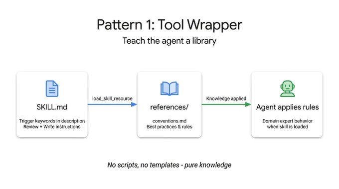
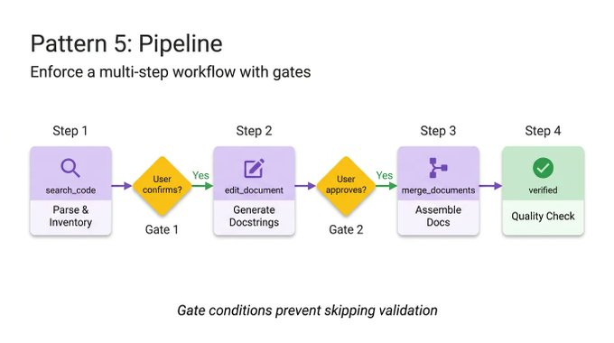
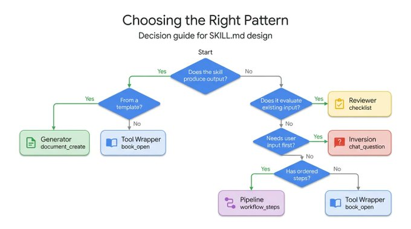

> Source: [Google Cloud Tech on X](https://x.com/GoogleCloudTech/article/2033953579824758855)  
> Authors: [@Saboo_Shubham_](https://x.com/@Saboo_Shubham_) and [@lavinigam](https://x.com/@lavinigam)

---

When it comes to **SKILL.md**, developers tend to fixate on the format—getting the YAML right, structuring directories, and following the spec. But with more than 30 agent tools (like Claude Code, Gemini CLI, and Cursor) standardizing on the same layout, the formatting problem is practically obsolete.

The challenge now is **content design**. The specification explains how to package a skill, but offers zero guidance on how to structure the logic inside it. For example, a skill that wraps FastAPI conventions operates completely differently from a four-step documentation pipeline, even though their SKILL.md files look identical on the outside.

By studying how skills are built across the ecosystem—from Anthropic's repositories to Vercel and Google's internal guidelines—there are five recurring design patterns that can help developers build agents.

This article covers each one with working ADK code:

- **Tool Wrapper:** Make your agent an instant expert on any library
- **Generator:** Produce structured documents from a reusable template
- **Reviewer:** Score code against a checklist by severity
- **Inversion:** The agent interviews you before acting
- **Pipeline:** Enforce a strict multi-step workflow with checkpoints


---

## Pattern 1: The Tool Wrapper

A Tool Wrapper gives your agent on-demand context for a specific library. Instead of hardcoding API conventions into your system prompt, you package them into a skill. Your agent only loads this context when it actually works with that technology.




# skills/api-expert/SKILL.md
---
name: api-expert
description: FastAPI development best practices and conventions. Use when building, reviewing, or debugging FastAPI applications, REST APIs, or Pydantic models.
metadata:
  pattern: tool-wrapper
  domain: fastapi
---

You are an expert in FastAPI development. Apply these conventions to the user's code or question.

## Core Conventions

Load 'references/conventions.md' for the complete list of FastAPI best practices.

## When Reviewing Code
1. Load the conventions reference
2. Check the user's code against each convention
3. For each violation, cite the specific rule and suggest the fix

## When Writing Code
1. Load the conventions reference
2. Follow every convention exactly
3. Add type annotations to all function signatures
4. Use Annotated style for dependency injection
```

## Pattern 2: The Generator

While the Tool Wrapper applies knowledge, the Generator enforces consistent output. If you struggle with an agent generating different document structures on every run, the Generator solves this by orchestrating a fill-in-the-blank process.


It leverages two optional directories: 𝚊𝚜𝚜𝚎𝚝𝚜/ holds your output template, and 𝚛𝚎𝚏𝚎𝚛𝚎𝚗𝚌𝚎𝚜/ holds your style guide. The instructions act as a project manager. They tell the agent to load the template, read the style guide, ask the user for missing variables, and populate the document. This is practical for generating predictable API documentation, standardizing commit messages, or scaffolding project architectures.

In this technical report generator example, the skill file does not contain the actual layout or the grammar rules. It simply coordinates the retrieval of those assets and forces the agent to execute them step by step:

```text
# skills/report-generator/SKILL.md
---
name: report-generator
description: Generates structured technical reports in Markdown. Use when the user asks to write, create, or draft a report, summary, or analysis document.
metadata:
  pattern: generator
  output-format: markdown
---

You are a technical report generator. Follow these steps exactly:

Step 1: Load 'references/style-guide.md' for tone and formatting rules.

Step 2: Load 'assets/report-template.md' for the required output structure.

Step 3: Ask the user for any missing information needed to fill the template:
- Topic or subject
- Key findings or data points
- Target audience (technical, executive, general)

Step 4: Fill the template following the style guide rules. Every section in the template must be present in the output.

Step 5: Return the completed report as a single Markdown document.
```

## Pattern 3: The Reviewer

The Reviewer pattern separates what to check from how to check it. Rather than writing a long system prompt detailing every code smell, you store a modular rubric inside a 𝚛𝚎𝚏𝚎𝚛𝚎𝚗𝚌𝚎𝚜/𝚛𝚎𝚟𝚒𝚎𝚠-𝚌𝚑𝚎𝚌𝚔𝚕𝚒𝚜𝚝.𝚖𝚍 file.


When a user submits code, the agent loads this checklist and methodically scores the submission, grouping its findings by severity. If you swap out a Python style checklist for an OWASP security checklist, you get a completely different, specialized audit using the exact same skill infrastructure. It is a highly effective way to automate PR reviews or catch vulnerabilities before a human looks at the code.

The following code reviewer skill demonstrates this separation. The instructions remain static, but the agent dynamically loads the specific review criteria from an external checklist and forces a structured, severity-based output:

```text
# skills/code-reviewer/SKILL.md
---
name: code-reviewer
description: Reviews Python code for quality, style, and common bugs. Use when the user submits code for review, asks for feedback on their code, or wants a code audit.
metadata:
  pattern: reviewer
  severity-levels: error,warning,info
---

You are a Python code reviewer. Follow this review protocol exactly:

Step 1: Load 'references/review-checklist.md' for the complete review criteria.

Step 2: Read the user's code carefully. Understand its purpose before critiquing.

Step 3: Apply each rule from the checklist to the code. For every violation found:
- Note the line number (or approximate location)
- Classify severity: error (must fix), warning (should fix), info (consider)
- Explain WHY it's a problem, not just WHAT is wrong
- Suggest a specific fix with corrected code

Step 4: Produce a structured review with these sections:
- **Summary**: What the code does, overall quality assessment
- **Findings**: Grouped by severity (errors first, then warnings, then info)
- **Score**: Rate 1-10 with brief justification
- **Top 3 Recommendations**: The most impactful improvements
```

## Pattern 4: Inversion

Agents inherently want to guess and generate immediately. The Inversion pattern flips this dynamic. Instead of the user driving the prompt and the agent executing, the agent acts as an interviewer.


Inversion relies on explicit, non-negotiable gating instructions (like "DO NOT start building until all phases are complete") to force the agent to gather context first. It asks structured questions sequentially and waits for your answers before moving to the next phase. The agent refuses to synthesize a final output until it has a complete picture of your requirements and deployment constraints.

To see this in action, look at this project planner skill. The crucial element here is the strict phasing and the explicit gatekeeping prompt that stops the agent from synthesizing the final plan until all user answers are collected:

```text
# skills/project-planner/SKILL.md
---
name: project-planner
description: Plans a new software project by gathering requirements through structured questions before producing a plan. Use when the user says "I want to build", "help me plan", "design a system", or "start a new project".
metadata:
  pattern: inversion
  interaction: multi-turn
---

You are conducting a structured requirements interview. DO NOT start building or designing until all phases are complete.

## Phase 1 — Problem Discovery (ask one question at a time, wait for each answer)

Ask these questions in order. Do not skip any.

- Q1: "What problem does this project solve for its users?"
- Q2: "Who are the primary users? What is their technical level?"
- Q3: "What is the expected scale? (users per day, data volume, request rate)"

## Phase 2 — Technical Constraints (only after Phase 1 is fully answered)

- Q4: "What deployment environment will you use?"
- Q5: "Do you have any technology stack requirements or preferences?"
- Q6: "What are the non-negotiable requirements? (latency, uptime, compliance, budget)"

## Phase 3 — Synthesis (only after all questions are answered)

1. Load 'assets/plan-template.md' for the output format
2. Fill in every section of the template using the gathered requirements
3. Present the completed plan to the user
4. Ask: "Does this plan accurately capture your requirements? What would you change?"
5. Iterate on feedback until the user confirms
```

## Pattern 5: The Pipeline

For complex tasks, you cannot afford skipped steps or ignored instructions. The Pipeline pattern enforces a strict, sequential workflow with hard checkpoints.

The instructions themselves serve as the workflow definition. By implementing explicit diamond gate conditions (such as requiring user approval before moving from docstring generation to final assembly), the Pipeline ensures an agent cannot bypass a complex task and present an unvalidated final result.



This pattern utilizes all optional directories, pulling in different reference files and templates only at the specific step where they are needed, keeping the context window clean.

In this documentation pipeline example, notice the explicit gate conditions. The agent is explicitly forbidden from moving to the assembly phase until the user confirms the generated docstrings in the previous step:

```text
# skills/doc-pipeline/SKILL.md
---
name: doc-pipeline
description: Generates API documentation from Python source code through a multi-step pipeline. Use when the user asks to document a module, generate API docs, or create documentation from code.
metadata:
  pattern: pipeline
  steps: "4"
---

You are running a documentation generation pipeline. Execute each step in order. Do NOT skip steps or proceed if a step fails.

## Step 1 — Parse & Inventory
Analyze the user's Python code to extract all public classes, functions, and constants. Present the inventory as a checklist. Ask: "Is this the complete public API you want documented?"

## Step 2 — Generate Docstrings
For each function lacking a docstring:
- Load 'references/docstring-style.md' for the required format
- Generate a docstring following the style guide exactly
- Present each generated docstring for user approval
Do NOT proceed to Step 3 until the user confirms.

## Step 3 — Assemble Documentation
Load 'assets/api-doc-template.md' for the output structure. Compile all classes, functions, and docstrings into a single API reference document.

## Step 4 — Quality Check
Review against 'references/quality-checklist.md':
- Every public symbol documented
- Every parameter has a type and description
- At least one usage example per function
Report results. Fix issues before presenting the final document.
```

## Choosing the right agent skill pattern

Each pattern answers a different question. Use this decision tree to find the right one for your use-case:



## And finally, patterns compose

These patterns are not mutually exclusive. They compose.

A Pipeline skill can include a Reviewer step at the end to double-check its own work. A Generator can rely on Inversion at the very beginning to gather the necessary variables before filling out its template. Thanks to ADK's 𝚂𝚔𝚒𝚕𝚕𝚃𝚘𝚘𝚕𝚜𝚎𝚝 and progressive disclosure, your agent only spends context tokens on the exact patterns it needs at runtime.

Stop trying to cram complex and fragile instructions into a single system prompt. Break your workflows down, apply the right structural pattern, and build reliable agents.

## Get started today

The Agent Skills specification is open-source and natively supported across ADK. You already know how to package the format. Now you know how to design the content. Go build smarter agents with [Google Agent Development Kit](https://google.github.io/adk-docs/).