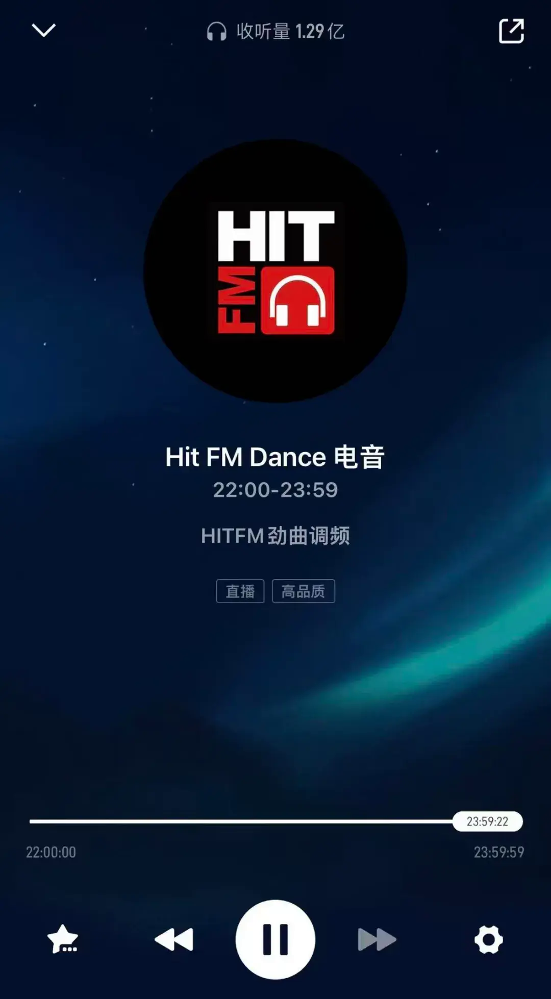
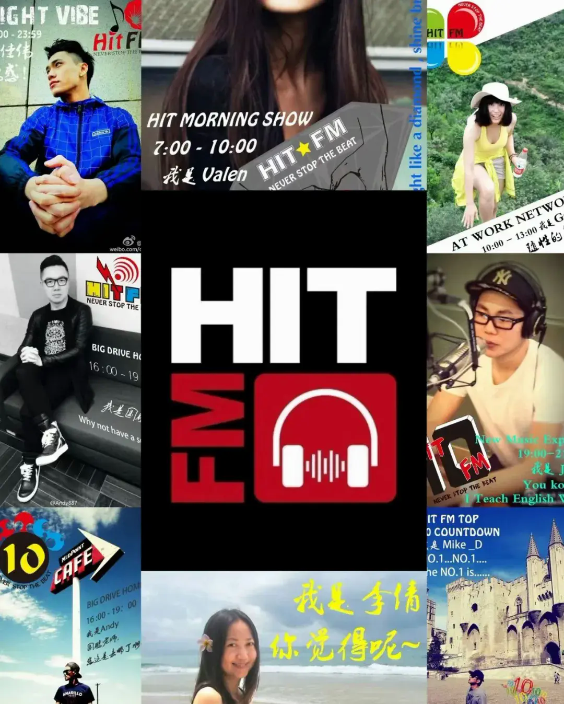
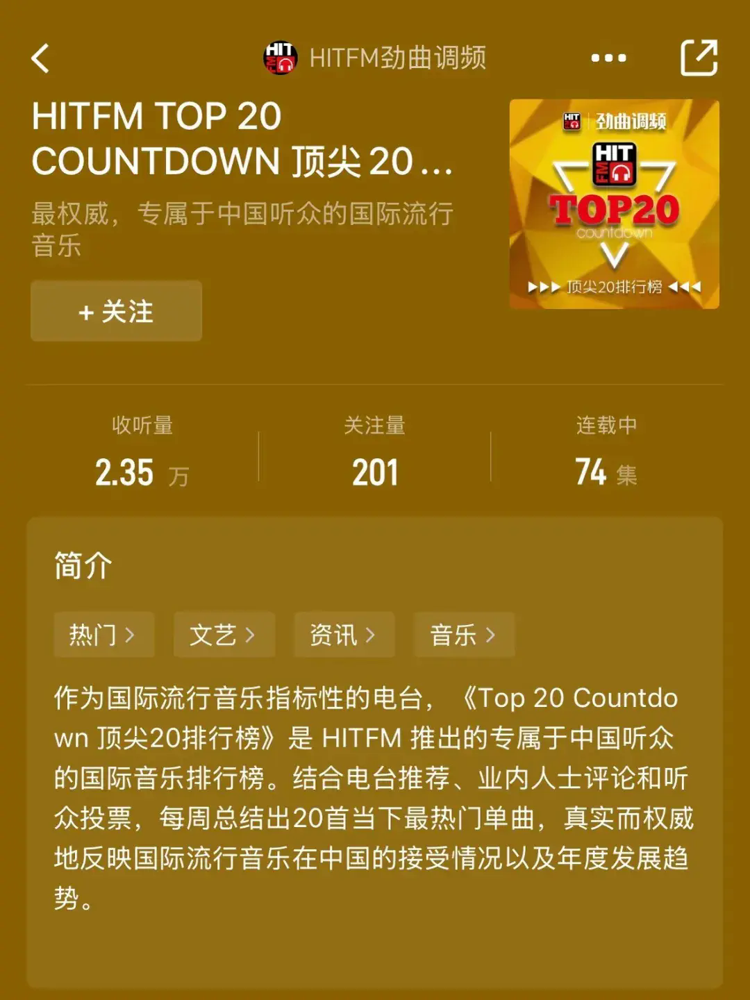
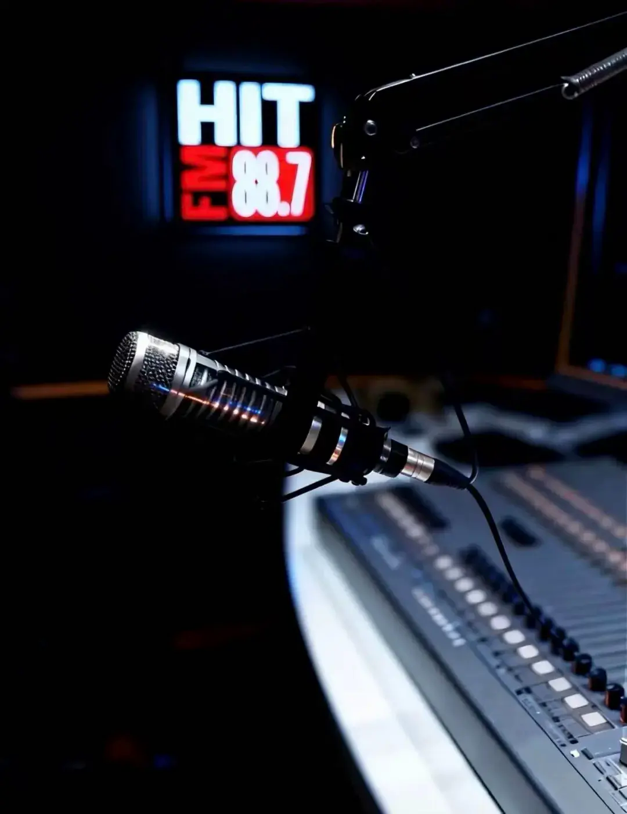
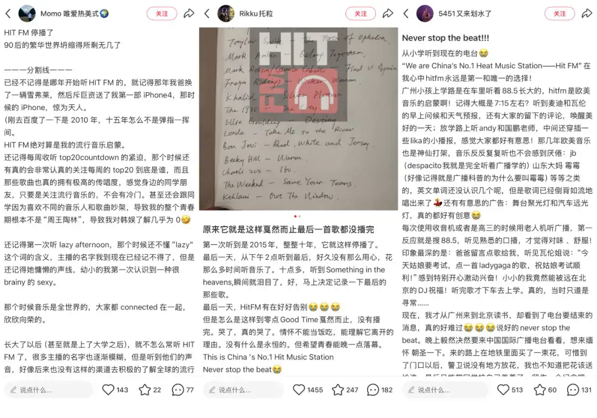

2025年12月23日，Hit FM 停播了，一代人的时代记忆悄然落幕。

停播前播放的最后一首歌是 Owl City 和 Carly Rae Jepsen 的《Good Time》，歌曲还没播完就到了零点报时。在五个单音节的“滴”声之后，只剩下一片静默。

当熟悉的88.7兆赫再未响起‘Never Stop The Beat’，一种巨大的空虚感在城市上空蔓延。这不仅是一个电台的消失，更是一代人被切断了的青春记忆锚点。

将时钟回拨至2003年，彼时的中国互联网尚处于拨号与宽带交接的前夜，智能手机还未重塑人类的感官，人们对外部世界的渴望正随着加入WTO后的开放浪潮野蛮生长。Hit FM 正是在这股激荡的时代气流中横空出世，用国际化包装和零时差的欧美金曲，为当时极度渴望与世界接轨的人们打开了一扇听觉的落地窗。

### 用电波打开审美视野

在那个MP3还需要用USB线下载歌曲的年代，Hit FM的横空出世算得上是一场听觉维度的“工业革命”。

它彻底颠覆了当时国内广播充斥着广告和冗长谈话的旧模式，率先引入了国际通用的“类型化电台”理念——其核心特点是全天24小时滚动播放特定类型的音乐，通过统一的音乐流、高度风格化的包装和DJ串场，维持频道听感的高度一致性，而非依赖单一明星节目的拼凑。

可以说，Hit FM是第一批真正培养了听众专辑意识和流派认知的音乐电台。DJ们——Mike D、Valen、Andy、国鹏、Max等等——不再是传统的播音员，而是那个贫瘠年代里的音乐布道者。

这种“布道”在当时甚至是具有侵略性的。在那个大多数人还沉浸在抒情慢歌的舒适区时，Hit FM以欧美音乐为载体，将嘻哈的碎拍、电子的轰鸣以及独立摇滚的粗粝感塞进了大众的耳朵。

当大部分车载广播还在轮播温和的情歌时，Hit FM已经让 Linkin Park 的《In The End》成为了京沪城市道路上的“背景音”。对于当时的听众而言，这种将说唱与重金属熔于一炉的“新金属”风格是极具冲击力的，强行撑开了国内听众对于“主流音乐”的定义边界。

不仅如此，作为 格莱美颁奖典礼 在中国长期的独家广播合作伙伴，Hit FM曾是无数音乐从业者和发烧友每年二月“听见格莱美”的唯一渠道。在那个流媒体尚未普及的年代，包括环球、索尼、华纳在内的国际三大唱片公司，均将Hit FM的“新歌首播”视为欧美艺人进入中国市场的首选路径。

而每周六下午雷打不动的《Top 20 Countdown》，更在当时的欧美音乐受众中，拥有着近乎“圣经”般的权威性——一首新歌在榜单上的排位，直接决定了它在中国市场的传唱度。对于当时初入社会的80后和还在上学的90后而言，Hit FM更是英语听力的免费教材和欧美流行文化的启蒙老师。

它引导听众跳出的是“专注歌词”的审美惯性，学着欣赏编曲的质感、制作的音色以及不同流派的文化内核；像一位严厉又富有远见的导师，耐心地拆解一首歌曲词曲背后的R&B律动，或是梳理英伦摇滚的历史脉络，将听歌这件事从娱乐提升到了审美的高度。

### 一统南北音乐审美

在那个中国流行文化地域差异显著的年代，Hit FM是为数不多统一了南北音乐审美的电台。这种统治力，也是其能将音乐能量发挥为一种生活方式的重要内核。

据行业数据统计，Hit FM在开播后不久，便牢牢占据了京沪的车载收听份额榜首。因此，它也一度成为了国际一线品牌进入中国市场的首选发声地。

除了空中的电波，Hit FM用超前于当时时代的线下触角，完成了对都市青年生活方式的实体构建。在“沉浸式体验”尚未成为营销热词的时代，“Hit FM万圣节派对”就已是京沪两地最炙手可热的年度盛事。

在那个国际巨星对于中国粉丝尚显遥远的年代，“Hit FM Live”系列曾邀请过众多国际知名艺人进行直播或专访，也带着听众直击过不少国际音乐盛事现场。将世界各地的顶级音乐现场“搬”到中国听众的耳边，完成了从线上艺人专访到线下盛事转播的完整音乐场景覆盖。

在2007年的时候，Hit FM还曾联合 索尼唱片 公司推出了“I Can Beat Avril”评选活动，通过“Hit FM千人音乐派对”公布结果并安排幸运歌迷与Avril Lavigne会面；此外，DJ国鹏在Hit FM节目中曾现场报道Avril Lavigne的香港行程，包括独家采访和歌曲首播。‌‌

作为当时国内极少数能够组织与国际艺人互动的媒体平台之一，对于听众而言，Hit FM不再只是一个播放器，而是一种生活方式的“实体入口”。最为关键的是，它让一代人相信，无论身处何地，只要戴上耳机，自己就站在了世界流行文化的最前沿。

不仅如此，在Hit FM所代表的旧世界里，音乐传播的核心逻辑是“策展”和“导赏”。这是一种基于专业DJ和音乐总监审美判断的“自上而下”的推荐机制。

当算法取代了DJ，当大数据取代了专业审美，我们看似拥有了整个音乐海洋的无限选择权，实则失去了探索未知的罗盘；Hit FM的离去，正是这一不可逆转的行业代际更替中沉重的休止符。

### 换种方式再见面

停播前，Hit FM 多位元老级DJ在直播间的连线，也算是这群曾经代表了国内电台黄金时代声音的人们与Hit FM 和那个时代的一场私人化、非正式告别。在社交媒体上，Hit FM的停播更是引发了一场盛大的“赛博葬礼”。

Hit FM停播前最后一晚，DJ们连线直播

打开DJ国鹏在小红书上发布的、关于停播的笔记评论区，更像在翻阅一本青春回忆录。有一位IP地址在海外的网友分享道：他从上学到上班，再到结婚生子，后又因工作移民海外的这些年，整个青春都是听着Hit FM度过的。在停播那天，他忍不住哭了。

88.7兆赫最终成为了一代人记忆中的一条“幽灵频率”，虽然物理意义上的发射塔已经停止工作，但那段伴随着欧美金曲呼啸而过的青春岁月，将永远在这一代人的脑海中循环播放，成为我们在算法荒漠中前行时，偶尔回望的一座温暖灯塔。

听众们在社交媒体中发表的回忆

好在当调频波段的电流切断，互联网的数据流却为这些声音接驳上了新的生命线。

Mike D、Valen等人也活跃在社媒和短视频平台，通过直播连线，延续着特有的“陪伴感”；Andy也做了一档名为《马斯特原理》的视频播客栏目。就在前段时间，Mike D在直播间还播放了DJ们在Hit FM十周年台庆时录制的《Just Give Me A Reason》。

Valen、Mike D、Andy（从左至右）

不仅如此，哔哩哔哩已与Hit FM的前成员们取得接触，并商讨合作事宜。在B站近日发布的“广播电台主持人扶持计划”海报上，赫然印着那句经典的标语——“Never Stop The Beat”。媒介变了，但内核未变。

B站的海报上写着“让陪伴几代人成长的声音、音乐永不消失”，这或许预示着一种新的行业生态：传统广播的“全城共听”模式已死，但基于共同兴趣和人格魅力的“社群共听”正在重生。

未来的日子里，或许再也无法通过88.7兆赫偶遇他们，但我们会在播客的订阅列表里、在B站的视频弹幕里、在社交媒体的直播间里，与这些老朋友重逢。

Hit FM 作为一家电台已经完成了它的历史使命。最后，正如在最后一期的《Top 20 Countdown》结束时，Andy引用 《楚门的世界》 的那句经典台词："Good morning, in case I don't see you, good afternoon, good evening, and good night!"

各位，Never Stop The Beat！
