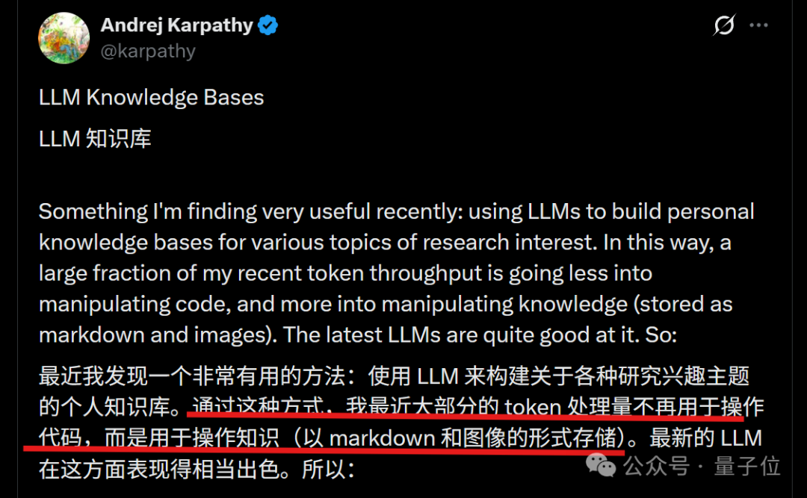
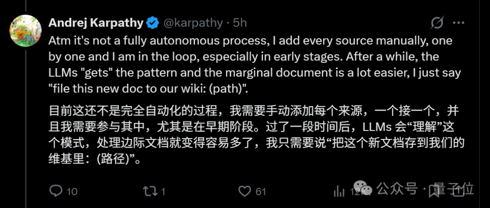
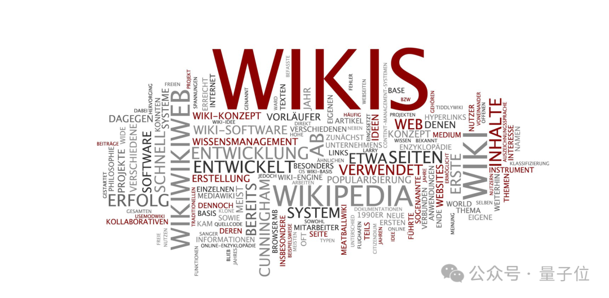
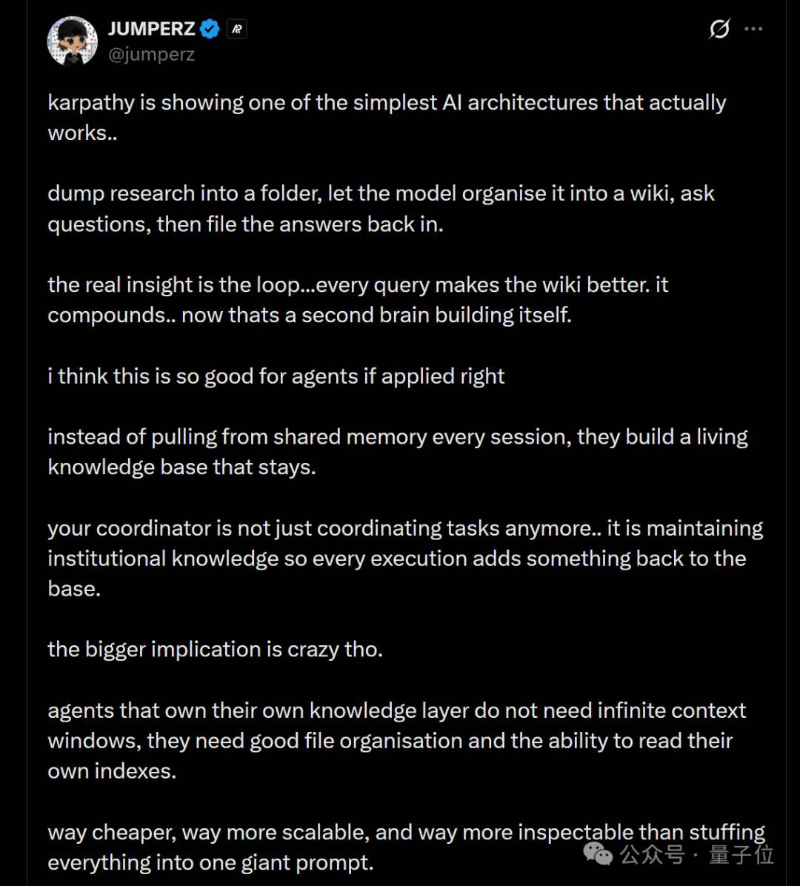
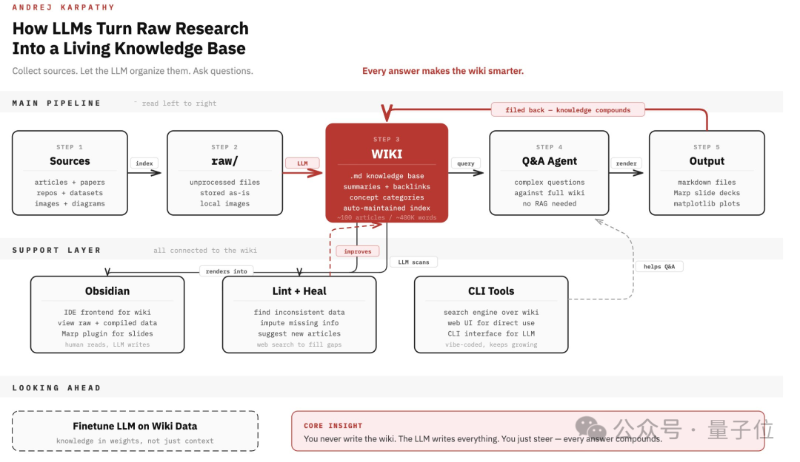

> 来源：[Andrej Karpathy on X](https://x.com/karpathy/status/2039805659525644595)  
> 作者：Andrej Karpathy

## 一、核心观点

Andrej Karpathy（卡帕西）提出了一种基于AI的个人知识库构建方法，其核心创新在于：

1. **自动维护与更新**：知识库能够自我更新和优化，不需要人工持续维护
2. **循环增强机制**：每次查询的结果都会被归档回知识库，形成知识积累的正向循环
3. **从"记忆"到"检索"**：改变了传统AI依赖大上下文窗口的模式，转而构建可持续查找的知识系统

卡帕西自己表示："现在大部分Token都不是用来写代码，而是拿来跑知识库了"，这反映了AI应用范式的重要转变。

## 二、实施方法

### 第一步：导入数据

**操作要点**：
- 将所有原始资料（文章、论文、代码等）打包到一个文件夹（raw/）
- 无需人工预先整理分类
- 使用大模型将原始资料编译成结构化的维基百科格式

**AI自动处理内容**：
- 为每篇资料生成摘要
- 建立内容间的反向链接
- 进行概念分类和归档
- 根据已有资料撰写新的综合性内容

**工具推荐**：
- Obsidian Web Clipper插件：一键将网页转换为Markdown文件，并下载图片到本地

### 第二步：前端查看数据

**查看内容**：
- 原始数据（raw/文件夹）
- 编译好的维基百科
- 生成的可视化图表

**推荐工具**：
- Obsidian：作为浏览面板，支持多种插件（如Marp生成幻灯片）

**关键特点**：
- 维基内容几乎全部由大模型编写和维护
- 人工很少直接修改内容

### 第三步：使用与循环优化

**使用方式**：
- 直接向AI提问，AI会检索知识库并给出答案
- 卡帕西的实践：100篇文章（约40万字）的知识库，无需复杂的RAG技术
- 关键：大模型维护好索引文件和摘要即可高效检索

**循环增强机制**：
1. 每次查询的输出结果归档回维基
2. 个人探索和提问不断在知识库中沉淀
3. 知识库持续累积和优化

**自动维护机制**：

1. **Lint+Heal机制**：
   - 定期扫描整个知识库
   - 自动发现不一致的数据
   - 补全缺失信息
   - 主动建议新增条目
   - 通过外部搜索补齐空缺

2. **CLI工具层**：
   - 提供搜索和访问接口
   - 支持大模型高效检索
   - 方便人通过命令行或网页使用

## 三、核心价值与影响

### 1. 从"存储工具"到"运行系统"

传统知识库：
- 需要人不断维护
- 静态存储
- 容易过时

卡帕西的知识库：
- 大模型持续整理和更新
- 动态演化
- 自我优化

### 2. 解决记忆问题的新范式

**传统方式**：
- 依赖大上下文窗口
- 强行让模型记住所有信息
- 容易遗忘和混淆

**新方式**：
- 信息长期存储在知识库
- 模型按需读取
- 从"让模型记住"变成"让系统可查找"

### 3. 对智能体（Agent）的影响

网友评价指出的关键优势：

- **持续存在的知识层**：不再是临时共享内存，而是有生命力的知识库
- **无需无限上下文**：只需要良好的文件组织和索引能力
- **更经济高效**：比巨大提示词更便宜、扩展性更强
- **可检查性**：更容易理解和调试

### 4. 知识积累的正向循环

> "每个查询都让维基变得更好。它不断积累，现在这就像一个自我构建的第二大脑。"

这种循环机制使得：
- 使用即是贡献
- 知识库越用越智能
- 形成个性化的"第二大脑"

## 四、总结

卡帕西的个人知识库方法展示了AI应用的新方向：

1. **简单而有效**：不需要复杂的技术架构，核心是"导入-整理-使用-归档"的循环
2. **自动化维护**：AI负责组织、更新和优化，人只需要使用
3. **范式转变**：从追求更大的上下文窗口，转向构建可持续查找的知识系统
4. **智能体基础**：为未来的AI智能体提供了持续存在的知识层

这不仅是个人知识管理的新方法，更可能是AI应用从"对话工具"向"智能系统"演进的重要方向。

---

参考链接：  
\[1\]https://x.com/karpathy/status/2039805659525644595  
\[2\]https://x.com/jumperz/status/2039826228224430323